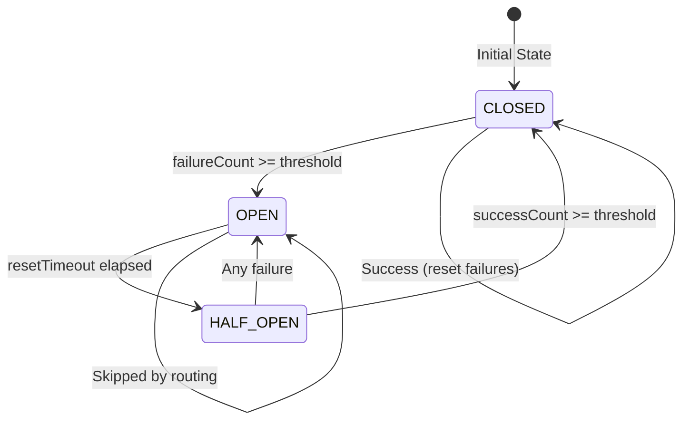

# Circuit Breaker & Failover Ordering - Implementation Walkthrough

## Summary

Implemented the circuit breaker pattern and failover ordering for RPC provider management in the WDK indexers. This enhancement improves the reliability of `getBalance` requests by intelligently routing traffic away from failing RPC providers and prioritizing healthy ones.

---

## Changes Made

### [rpc.base.manager.js](file:///Users/alexa/Documents/repos/tether/_INDEXER/wdk-indexer-wrk-base/workers/lib/rpc.base.manager.js)

**Key Changes:**

1. **Circuit Breaker State Machine**

   - Three states: `CLOSED` (healthy), `OPEN` (failing), `HALF_OPEN` (testing recovery)
   - Automatic state transitions based on failure counts and timeouts

2. **Per-Provider Health Tracking**

   - Each provider tracks: `failureCount`, `lastFailureTime`, `state`, `successCount`
   - Health data persists across calls for intelligent routing

3. **Separated State Mutation from State Reading** (Review Fix #1)

   - `_updateProviderState()` - Handles mutations (OPEN → HALF_OPEN transition)
   - `_getProviderState()` - Pure read, no side effects
   - States are updated BEFORE sorting to avoid side effects in sort comparator

4. **Single Unified Retry Loop** (Review Fix #3)

   - Replaced two-loop structure with single `for` loop
   - Cycles through providers: `attempt % providers.length`
   - Refreshes ordering each attempt for accurate health-based routing
   - Distributes retries across providers instead of hammering one

5. **Failover Ordering**

   - Pre-compute states and failure counts before sorting (pure comparator)
   - Priority order: CLOSED → HALF_OPEN → OPEN
   - Within same state, lower failure counts preferred
   - Automatic fallback to OPEN providers when all are failing

6. **Configurable Thresholds** (with sensible defaults)
   - `failureThreshold` (default: 3) - failures before opening circuit
   - `resetTimeout` (default: 30000ms) - time before trying half-open
   - `successThreshold` (default: 2) - successes to close from half-open

---

## How It Works



**Example Flow:**

1. Provider A fails 3 times → Circuit OPENS
2. Subsequent calls skip Provider A, use Provider B
3. After 30s, Provider A becomes HALF_OPEN
4. Next call tests Provider A
5. If success × 2 → Circuit CLOSES; if fail → back to OPEN

---

## Configuration

No configuration changes required - the feature uses sensible defaults. Optional custom configuration via `circuitBreaker` option:

```javascript
// In chain client constructor (e.g., ChainEvmClient)
this.rpcManager = new RpcBaseManager({
  mainRpc: this._setupProvider(ctx.conf.wrk.mainRpc),
  secondaryRpcs: ctx.conf.wrk.secondaryRpcs?.map(/*...*/),
  circuitBreaker: {
    failureThreshold: 5, // More tolerant of failures
    resetTimeout: 60000, // Wait 1 minute before retry
    successThreshold: 3, // Need 3 successes to recover
  },
});
```

---

## Design Decisions

### Weight Deduplication (Review Concern #6)

Weights create duplicates in `secondaries` array for round-robin distribution, but health tracking uses unique providers via `Set` deduplication. This is intentional:

- Weights affect **round-robin distribution** (the deprecated `secondary` getter)
- Health tracking treats each **unique provider** as one entity
- A provider shouldn't have "multiple healths" just because it has higher weight

This is documented with a code comment in `_getOrderedProviders()`.

---

## Backward Compatibility

- ✅ All existing code works without changes
- ✅ The `secondary` getter remains functional (deprecated but supported)
- ✅ Default behavior matches previous implementation
- ✅ Configuration is optional with sensible defaults

---

## Testing Results

### Unit Tests (25/25 passing)

```
# RpcBaseManager - constructor ✓
# RpcBaseManager - call() basic functionality ✓
# RpcBaseManager - circuit breaker state transitions ✓
# RpcBaseManager - failover ordering ✓
# RpcBaseManager - getHealthStatus() ✓
# RpcBaseManager - resetHealth() ✓
# RpcBaseManager - backward compatibility ✓
```

**Test file:** [rpc.base.manager.unit.test.js](file:///Users/alexa/Documents/repos/tether/_INDEXER/wdk-indexer-wrk-base/tests/rpc.base.manager.unit.test.js)

### Linting

```
✓ standard (no errors)
```

---

## Files Changed

| File                                                                                                                                          | Change                                |
| --------------------------------------------------------------------------------------------------------------------------------------------- | ------------------------------------- |
| [rpc.base.manager.js](file:///Users/alexa/Documents/repos/tether/_INDEXER/wdk-indexer-wrk-base/workers/lib/rpc.base.manager.js)               | Complete rewrite with circuit breaker |
| [rpc.base.manager.unit.test.js](file:///Users/alexa/Documents/repos/tether/_INDEXER/wdk-indexer-wrk-base/tests/rpc.base.manager.unit.test.js) | New comprehensive test file           |

---

## New APIs

### `getHealthStatus()`

Returns health status for all providers (useful for monitoring/debugging).
Updates provider states before reading to ensure transitions are reflected.

```javascript
const status = rpcManager.getHealthStatus();
// [{ provider: <provider>, health: { state, failureCount, ... }}]
```

### `resetHealth()`

Resets all provider health tracking (useful for testing or manual recovery):

```javascript
rpcManager.resetHealth();
```

### `CIRCUIT_STATES`

Exported enum for external use:

```javascript
const {
  CIRCUIT_STATES,
} = require("@tetherto/wdk-indexer-wrk-base/workers/lib/rpc.base.manager");
// { CLOSED: 'CLOSED', OPEN: 'OPEN', HALF_OPEN: 'HALF_OPEN' }
```

---

## Review Fixes Applied

| #   | Concern                 | Fix                                                                                  |
| --- | ----------------------- | ------------------------------------------------------------------------------------ |
| 1   | Side effects in sorting | Separated `_updateProviderState()` (mutation) from `_getProviderState()` (pure read) |
| 3   | Complex retry logic     | Replaced two-loop structure with single unified loop that cycles through providers   |
| 6   | Weight deduplication    | Added code comment explaining intentional behavior                                   |
