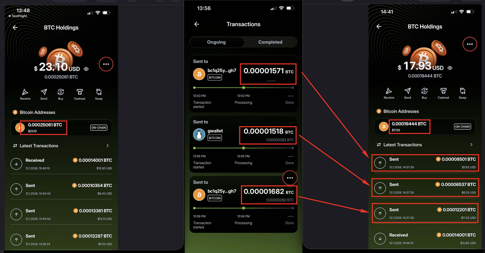
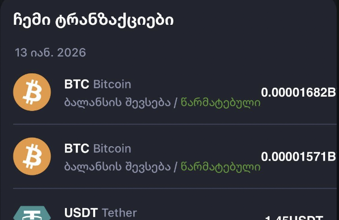
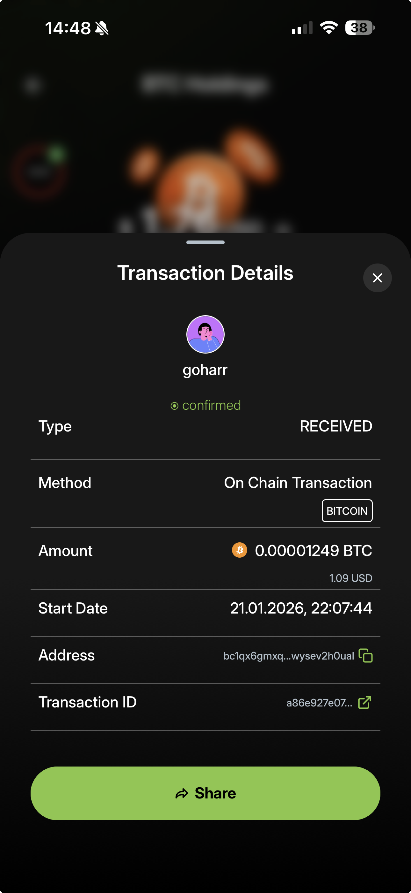
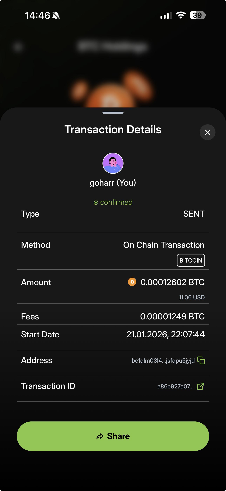
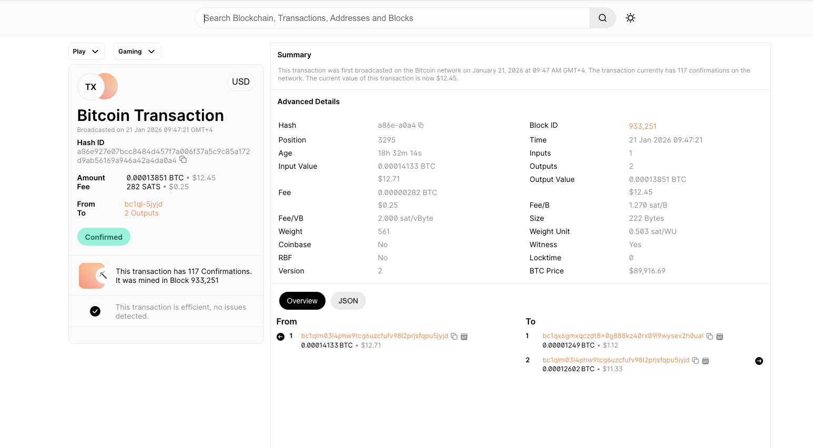

# Rumble - [Send] BTC transactions are logged with incorrect amounts

**Asana URL:** https://app.asana.com/1/45238840754660/project/1210540875949204/task/1212744757896562
**Ticket ID:** WDK-1098 / BUG-1054
**Created:** 2026-01-13
**Last Modified:** 2026-02-10
**Assignee:** Alex Atrash
**Completed:** No

## Custom Fields

| Field | Value |
|-------|-------|
| WDK | WDK-1098 |
| BUG | BUG-1054 |
| Severity | High |
| Estimated Points | 5 |
| Rumble Area | API / Backend |
| Platforms | iOS |

## Projects

- WDK Indexer and Wallet Backends (section: DEV IN PROGRESS)
- [RW] V1 Bugs Tracking (section: Blocked)

## Followers

- Gocha Gafrindashvili
- Agnislav Onufriichuk
- Gohar Grigoryan
- Alex Atrash

---

## Description

After sending a **BTC transaction**, the app logs **"Sent" transactions with incorrect BTC amounts** in the transaction history. The recorded amounts do **not match the actual sent amount**.

**Test User:** Kartofili / 123qweASD!
**Source address:** bc1q4ykyew79sc2fy6vjpyz2ze3g25rsjfwvqmu4zq
**Email:** 21rumbler@gmail.com

### Steps to Reproduce

1. Open the app and navigate to **BTC Holdings**.
2. Send BTC to a valid address.
3. Observe the **Ongoing transactions** list.
4. Wait until transactions are marked **Completed**.
5. Return to **BTC Holdings -> Latest Transactions**.

### Actual Result

- Each entry shows **different BTC amounts** (e.g. 0.00008501 BTC, 0.00006537 BTC, 0.00012201 BTC).
- The sum and breakdown are unclear and **do not transparently represent the original transaction**.
- BTC Holdings balance changes, but **cannot be clearly reconciled** with listed transactions.

### Expected Result

- Displayed amounts should accurately reflect:
  - Sent amount
  - Network fee

### Environment

- **Device:** iPhone 13, iOS 26.1
- **App Version:** v1.2.0 (286)

### Description Attachments

| # | File | Description |
|---|------|-------------|
| 1 |  | Holdings screen and transaction list showing incorrect amounts |
| 2 |  | Received transactions view |

---

## Comments

### Comment 1 - Gohar Grigoryan (2026-01-22)

> I also got this case from sender side the amount is incorrect, but from receiver's side the amount is correct. There are 2 transactions, the sender shows the higher one.

**Blockchain explorer link:** https://www.blockchain.com/explorer/transactions/btc/a86e927e07bcc8484d457f7a006f37a5c9c85a172d9ab56169a946a42a4da0a4

| # | File | Description |
|---|------|-------------|
| 3 |  | Sender side - shows incorrect amount |
| 4 |  | Receiver side - shows correct amount |
| 5 |  | Blockchain explorer transaction details |

---

## Activity Timeline

| Date | Who | Action |
|------|-----|--------|
| 2026-01-13 | Gocha Gafrindashvili | Created ticket, added to [RW] V1 Bugs Tracking |
| 2026-01-13 | Gocha Gafrindashvili | Attached Holdings + Transactions.png and Received transactions.png |
| 2026-01-13 | Gocha Gafrindashvili | Assigned to Agnislav Onufriichuk |
| 2026-01-13 | George Javakhidze | Changed Rumble Area to API / Backend, moved to "To Triage" |
| 2026-01-13 | George Javakhidze | Unassigned Agnislav |
| 2026-01-13 | Gocha Gafrindashvili | Updated description |
| 2026-01-22 | Gohar Grigoryan | Commented with sender/receiver screenshots and blockchain link |
| 2026-01-22 | Alex Atrash | Linked subtask: "Analyse wrong trx amount from backend perspective" (completed) |
| 2026-01-23 | Gohar Grigoryan | Assigned to Alex Atrash, added to WDK project, set WDK-1098 |
| 2026-01-23 | Gohar Grigoryan | Moved to "To Do" in Bugs Tracking |
| 2026-01-23 | Alex Atrash | Set Estimated Points to 5 |
| 2026-01-26 | George Javakhidze | Moved to "Need Response" in Bugs Tracking |
| 2026-02-02 | George Javakhidze | Moved to "Blocked" in Bugs Tracking |
| 2026-02-07 | Francesco Canessa | Renamed ticket |
| 2026-02-10 | Alex Atrash | Moved to "DEV IN PROGRESS" in WDK project |
